<div align="center">

<a href="https://github.com/brumaombra/ui-vintage">
    <picture>
        <source media="(prefers-color-scheme: dark)" srcset="docs/images/banner-dark.webp">
        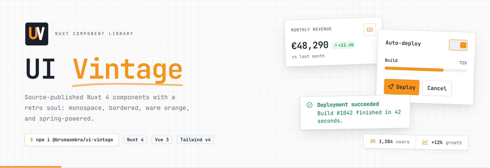
    </picture>
</a>

<p><b>84 explicit entry points</b> · <b>light and dark themes</b> · <b>9 built-in locales</b> · <b>accessible primitives on Reka UI</b></p>

<p>
    <a href="https://www.npmjs.com/package/@brumaombra/ui-vintage"></a>
    <a href="https://www.npmjs.com/package/@brumaombra/ui-vintage"></a>
    
    
    
    <a href="LICENSE"></a>
</p>

<p>
    <a href="#installation"><strong>Installation</strong></a> ·
    <a href="#usage"><strong>Usage</strong></a> ·
    <a href="#showcase"><strong>Showcase</strong></a> ·
    <a href="#components"><strong>Components</strong></a> ·
    <a href="#theming"><strong>Theming</strong></a> ·
    <a href="COMPONENTS.md"><strong>Component catalog</strong></a> ·
    <a href="#demo-app"><strong>Demo app</strong></a>
</p>

</div>

<br>

<picture>
    <source media="(prefers-color-scheme: dark)" srcset="docs/images/hero-dark.webp">
    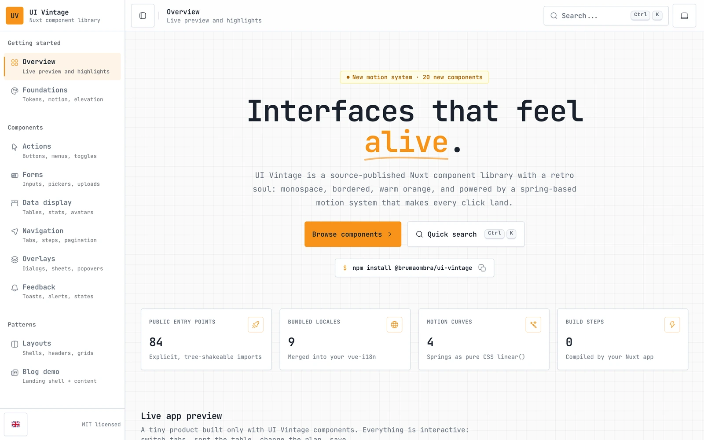
</picture>

## Why UI Vintage

UI Vintage is a Nuxt 4 module and component library for dashboards, forms, landing pages, overlays, and blogs that should look and feel like one product. It gives you low-level primitives (buttons, inputs, selects, dialogs, tabs) and complete building blocks (dashboard and landing shells, stat cards, data tables, a full blog) that share one set of theme tokens and one motion vocabulary.

- **Source-published.** The package ships its Vue and TypeScript source. Your Nuxt app compiles it together with your own code, so there is no separate build artifact and every Nuxt integration (`NuxtImg`, `#components`, module hooks) keeps working.
- **Explicit imports.** Every component lives behind its own subpath, such as `@brumaombra/ui-vintage/button`. Nothing is auto-registered, so your dependencies stay obvious and tree-shakeable.
- **Accessible by default.** Interactive primitives are built on [Reka UI](https://reka-ui.com), with keyboard support, focus management, and ARIA wiring included.
- **Motion that respects people.** Springs are pure CSS `linear()` easings, and every animation collapses when the user prefers reduced motion.

## Features

- **Nuxt 4 module** that injects the stylesheet, transpiles the source, installs `@nuxt/image` when needed, and merges the library locale messages into Vue I18n.
- **Shared design tokens** for colors, borders, and elevation, with light, dark, and automatic themes and a circular View Transitions reveal when switching.
- **Primitives on Reka UI:** select, combobox, dialog, sheet, popover, tooltip, tabs, stepper, slider, calendar, date and time pickers, PIN input, tags input, and more.
- **Composite building blocks:** dashboard and landing shells, page headers, stat cards and stat strips, data tables with animated sorting, card grids with empty and loading states.
- **Promise-based flows:** `showConfirmDialog`, `showMessageDialog`, stacked and swipeable `showMessageToast`, and a shared busy overlay with `setBusy`.
- **A complete blog** for Nuxt Content: hero header, featured carousel, post header, table of contents, share sidebar, FAQ, reading progress, and VS Code-style code blocks.
- **Localization** in English, Italian, French, Spanish, German, Portuguese, Chinese, Japanese, and Russian.
- **Ready for AI coding agents:** a generated component catalog ([`COMPONENTS.md`](COMPONENTS.md)) and agent instructions ([`AGENTS.md`](AGENTS.md)) ship inside the package.

## Installation

Install the package and its peer integrations in an existing Nuxt 4 app:

```bash
npm install @brumaombra/ui-vintage @nuxt/image vue-i18n
```

Register the module in `nuxt.config`:

```js
export default defineNuxtConfig({
    modules: [
        '@brumaombra/ui-vintage'
    ]
});
```

That's it: the module injects the shared stylesheet, adds the source to Nuxt transpilation, installs `@nuxt/image` when your app has not registered it, and merges the library messages into your Vue I18n instance. Vue I18n is optional at runtime, but the translated components need it.

## Usage

### Use a component

Import components from their public subpath:

```vue
<script setup>
import { Button } from '@brumaombra/ui-vintage/button';
import { SingleValueCard } from '@brumaombra/ui-vintage/single-value-card';
import { Money03Icon } from '@hugeicons/core-free-icons';
</script>

<template>
    <SingleValueCard label="Revenue" :value="48290" :icon="Money03Icon" :trend="12.4" trend-label="vs last month"
        :format-options="{ style: 'currency', currency: 'EUR', maximumFractionDigits: 0 }" />

    <Button variant="primary">Save changes</Button>
</template>
```

### Ask, confirm, and notify

Dialogs, toasts, and the busy overlay mount themselves on first use, so you never place them in a layout:

```js
import { showConfirmDialog } from '@brumaombra/ui-vintage/confirm-dialog';
import { showMessageToast } from '@brumaombra/ui-vintage/message-toast';
import { setBusy } from '@brumaombra/ui-vintage/busy-indicator';

// Resolves true or false with the user's choice
const confirmed = await showConfirmDialog({
    title: 'Delete project?',
    message: 'This action cannot be undone.',
    confirmButtonType: 'red'
});

if (confirmed) {
    // Keep the shared loading overlay visible while the request runs
    setBusy(true, { label: 'Deleting project...' });
    await deleteProject();
    setBusy(false);

    showMessageToast({ type: 'success', title: 'Project deleted', message: 'Everything was removed.' });
}
```

### Build a layout

Shells own the layout and responsive behavior; your app owns the navigation data and the content:

```vue
<script setup>
import { DashboardShell } from '@brumaombra/ui-vintage/dashboard-shell';

// Sidebar sections and their links
const sidebarSections = [{
    id: 'workspace',
    label: 'Workspace',
    items: [
        { id: 'overview', label: 'Overview', href: '/', active: true },
        { id: 'settings', label: 'Settings', href: '/settings' }
    ]
}];
</script>

<template>
    <DashboardShell app-name="Acme" app-logo="/logo.svg" app-logo-dark="/logo-dark.svg" :sidebar-sections="sidebarSections">
        <slot />
    </DashboardShell>
</template>
```

<a id="showcase"></a>
## Showcase

Every screenshot comes from the [demo app](#demo-app), and each one follows your GitHub theme (light or dark).

<table>
    <tr>
        <td width="50%" valign="top">
            <picture>
                <source media="(prefers-color-scheme: dark)" srcset="docs/images/buttons-dark.webp">
                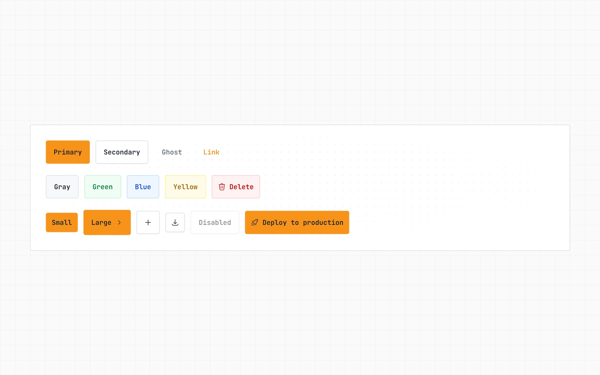
            </picture>
            <p align="center"><b>Buttons</b><br><sub>Variants, tones, sizes, icon buttons, and states</sub></p>
        </td>
        <td width="50%" valign="top">
            <picture>
                <source media="(prefers-color-scheme: dark)" srcset="docs/images/forms-dark.webp">
                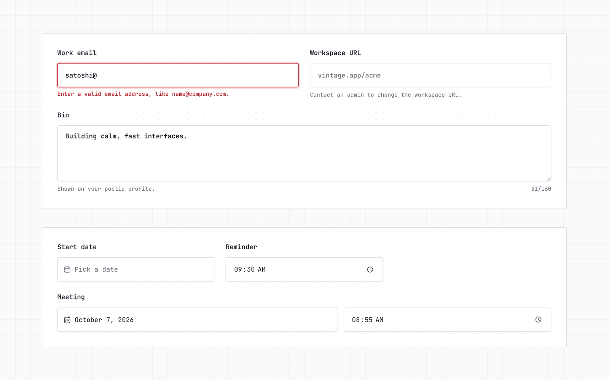
            </picture>
            <p align="center"><b>Forms</b><br><sub>Fields with validation, counters, and date and time pickers</sub></p>
        </td>
    </tr>
    <tr>
        <td width="50%" valign="top">
            <picture>
                <source media="(prefers-color-scheme: dark)" srcset="docs/images/data-table-dark.webp">
                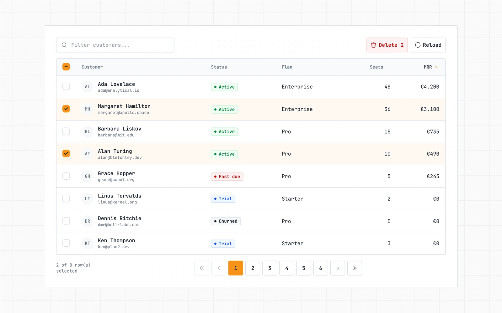
            </picture>
            <p align="center"><b>Data table</b><br><sub>Typed columns, selection, animated sorting, and pagination</sub></p>
        </td>
        <td width="50%" valign="top">
            <picture>
                <source media="(prefers-color-scheme: dark)" srcset="docs/images/stats-dark.webp">
                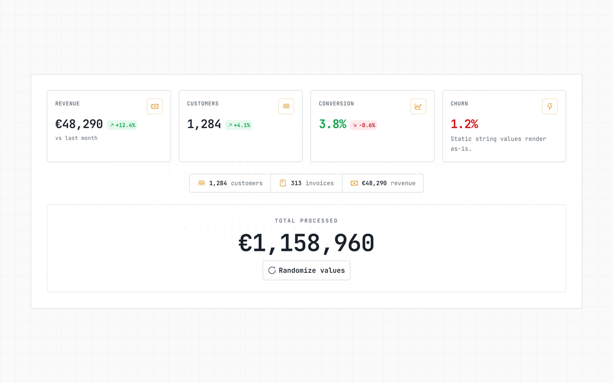
            </picture>
            <p align="center"><b>Stats and numbers</b><br><sub>Stat cards, the compact stat strip, and numbers that count up</sub></p>
        </td>
    </tr>
    <tr>
        <td width="50%" valign="top">
            <picture>
                <source media="(prefers-color-scheme: dark)" srcset="docs/images/navigation-dark.webp">
                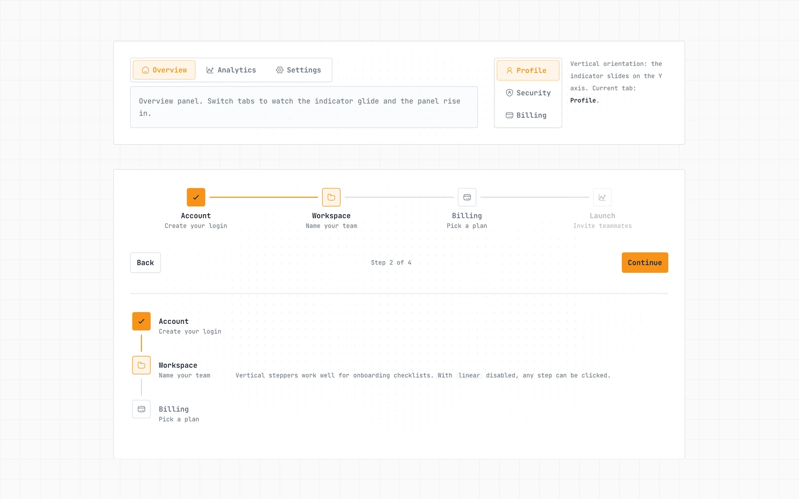
            </picture>
            <p align="center"><b>Navigation</b><br><sub>Tabs with a gliding indicator and horizontal or vertical steppers</sub></p>
        </td>
        <td width="50%" valign="top">
            <picture>
                <source media="(prefers-color-scheme: dark)" srcset="docs/images/alerts-dark.webp">
                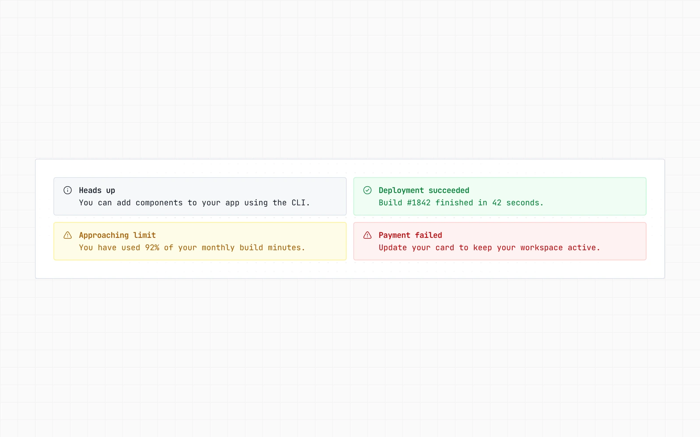
            </picture>
            <p align="center"><b>Alerts</b><br><sub>Tone surfaces for neutral, success, warning, and error messages</sub></p>
        </td>
    </tr>
    <tr>
        <td width="50%" valign="top">
            <picture>
                <source media="(prefers-color-scheme: dark)" srcset="docs/images/toasts-dark.webp">
                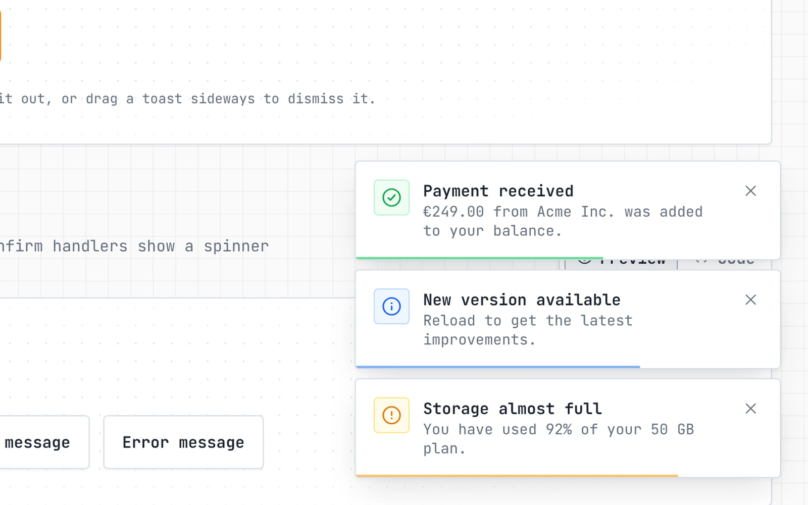
            </picture>
            <p align="center"><b>Toasts</b><br><sub>Stacked toasts that fan out on hover and can be swiped away</sub></p>
        </td>
        <td width="50%" valign="top">
            <picture>
                <source media="(prefers-color-scheme: dark)" srcset="docs/images/dialog-dark.webp">
                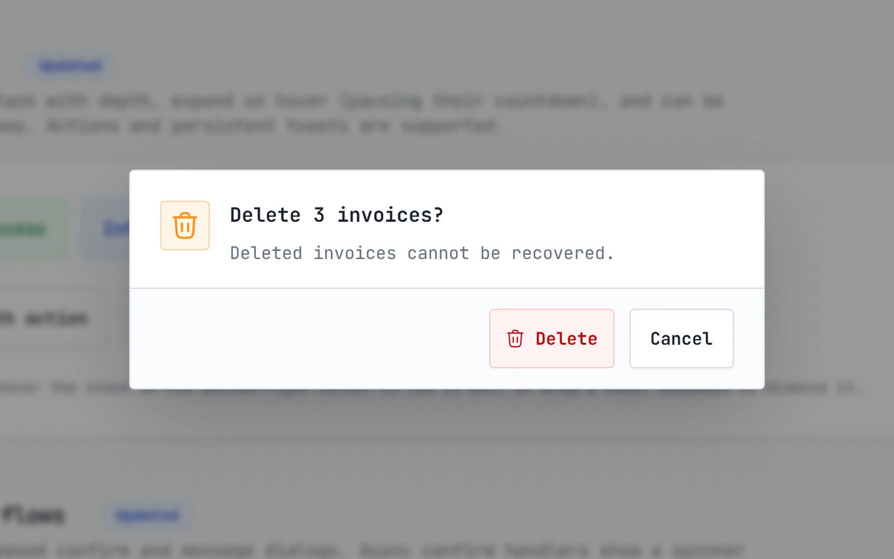
            </picture>
            <p align="center"><b>Confirm dialog</b><br><sub>Promise-based dialogs with async handlers</sub></p>
        </td>
    </tr>
    <tr>
        <td width="50%" valign="top">
            <picture>
                <source media="(prefers-color-scheme: dark)" srcset="docs/images/palette-dark.webp">
                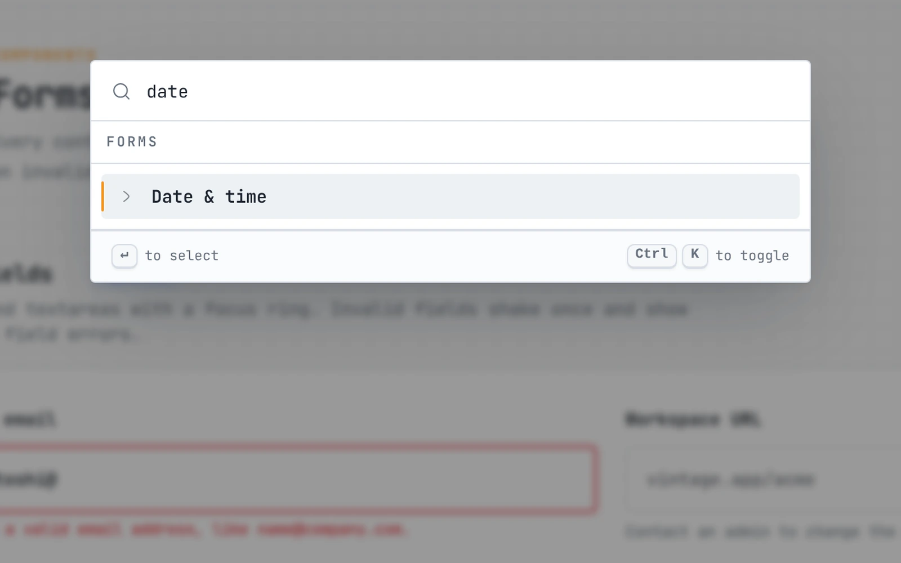
            </picture>
            <p align="center"><b>Command palette</b><br><sub>Searchable command menu with keyboard navigation</sub></p>
        </td>
        <td width="50%" valign="top">
            <picture>
                <source media="(prefers-color-scheme: dark)" srcset="docs/images/live-preview-dark.webp">
                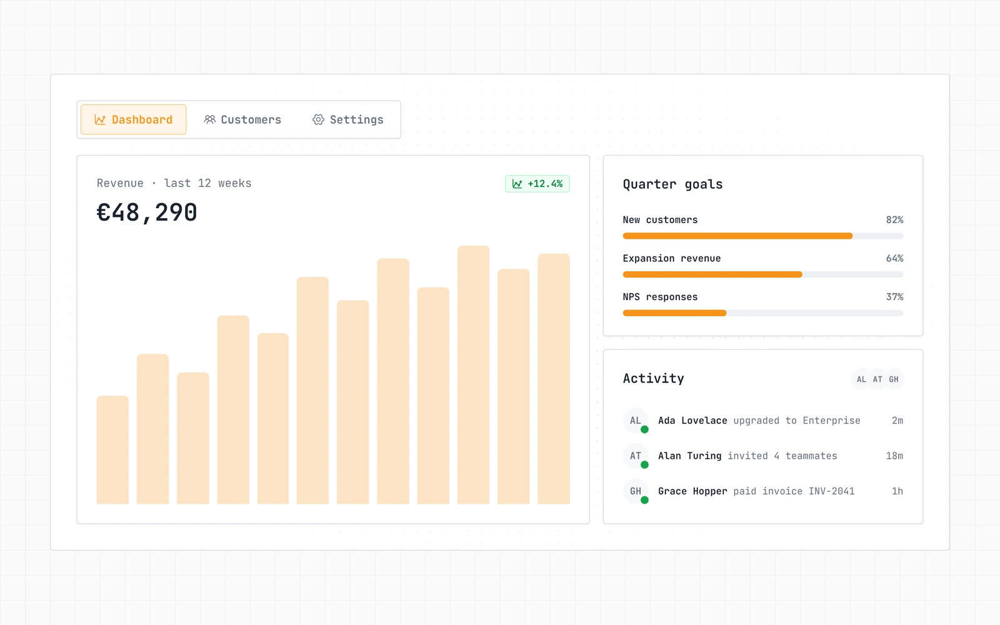
            </picture>
            <p align="center"><b>Built with UI Vintage</b><br><sub>A small dashboard made only from library components</sub></p>
        </td>
    </tr>
    <tr>
        <td width="50%" valign="top">
            <picture>
                <source media="(prefers-color-scheme: dark)" srcset="docs/images/blog-dark.webp">
                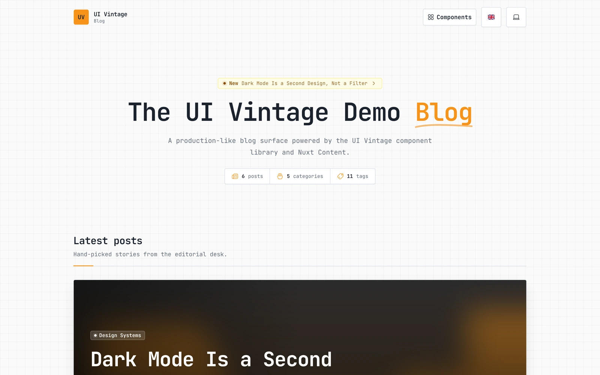
            </picture>
            <p align="center"><b>Blog home</b><br><sub>Hero header with stats and a featured carousel</sub></p>
        </td>
        <td width="50%" valign="top">
            <picture>
                <source media="(prefers-color-scheme: dark)" srcset="docs/images/post-dark.webp">
                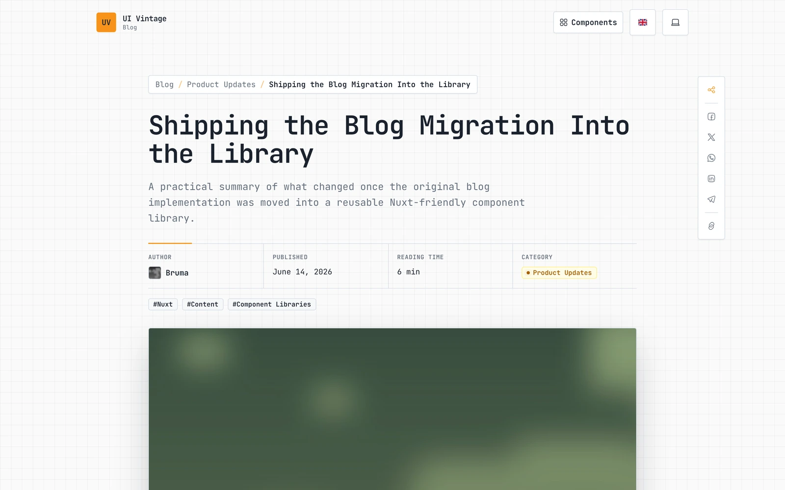
            </picture>
            <p align="center"><b>Blog post</b><br><sub>Post header with labelled details, tags, and the share sidebar</sub></p>
        </td>
    </tr>
</table>

## Components

84 entry points, grouped as in the catalog. Each name is also its import subpath, for example `@brumaombra/ui-vintage/data-table`.

| Category | Entry points |
| --- | --- |
| **Actions** | `button`, `dropdown-menu`, `kbd`, `load-more-button`, `text-link`, `toggle-group` |
| **Forms** | `calendar`, `checkbox`, `combobox`, `date-picker`, `date-time-picker`, `field`, `file-dropzone`, `input`, `label`, `native-select`, `number-field`, `pin-input`, `radio-group`, `select`, `slider`, `slider-form-component`, `switch`, `switch-form-component`, `tags-input`, `textarea`, `time-picker` |
| **Data display** | `animated-number`, `avatar`, `badge`, `card`, `card-grid`, `chip`, `data-list`, `data-table`, `info-card`, `progress`, `progress-component`, `scroll-area`, `separator`, `single-value-card`, `skeleton`, `stat-strip`, `table` |
| **Navigation** | `accordion`, `breadcrumb`, `collapsible`, `pagination`, `sidebar`, `stepper`, `tabs` |
| **Overlays** | `alert-dialog`, `command`, `dialog`, `hover-card`, `popover`, `sheet`, `tooltip` |
| **Feedback** | `alert`, `busy`, `busy-indicator`, `confirm-dialog`, `cookie-consent`, `empty-state-card`, `loading-state-card`, `message-dialog`, `message-toast`, `spinner` |
| **Layouts and app shell** | `background-grid`, `dashboard-shell`, `error-page`, `landing`, `landing-content`, `landing-footer`, `landing-navbar`, `landing-shell`, `language-flag`, `language-selector`, `page-header`, `theme-selector` |
| **Content and blog** | `blog`, `content` |
| **Utilities and types** | `common-types`, `utils` |

### Component catalog

[`COMPONENTS.md`](COMPONENTS.md) documents every entry point: its import line, props and defaults, events, slots, helpers, and examples. It is generated from the source and ships inside the package, so your app can always read the version it installed at `node_modules/@brumaombra/ui-vintage/COMPONENTS.md`.

### Using UI Vintage with AI coding agents

The package ships [`AGENTS.md`](AGENTS.md), a short set of instructions that teaches coding agents to reuse UI Vintage: read the catalog before writing UI, pick the right component, follow the library conventions, and check the result.

Point your agent to it from your app's own instructions file, so it always reads the version you installed:

- **Codex, Cursor, GitHub Copilot, Gemini, and other tools that read `AGENTS.md`:** add this line to the `AGENTS.md` at the root of your app:

  ```md
  Before writing UI, read and follow node_modules/@brumaombra/ui-vintage/AGENTS.md.
  ```

- **Claude Code:** import it in your app's `CLAUDE.md`:

  ```md
  @node_modules/@brumaombra/ui-vintage/AGENTS.md
  ```

Both the instructions and the catalog update with the package, so you never need to copy them again.

## Theming

### Tokens and dark mode

The stylesheet defines semantic tokens (`background`, `foreground`, `card`, `primary`, `muted`, `border`, and more) for both themes. Dark mode follows the `.dark` class on `<html>`; `ThemeSelector` sets it for you, with light, dark, and automatic modes. Extend the existing CSS custom properties in your app stylesheet instead of creating a second token system.

The module injects the stylesheet automatically. Import it explicitly only when you need to control the loading order:

```js
import '@brumaombra/ui-vintage/style.css';
```

`LandingNavbar`, `LandingFooter`, and `DashboardShell` accept `app-logo` and `app-logo-dark`, so your logo can follow the theme too.

### Motion

Every component uses the same small vocabulary, and your app can reuse it:

- **Easings:** `ease-spring`, `ease-bounce`, `ease-out-expo`, and `ease-snappy`.
- **Surfaces:** `uv-floating-motion` (popovers, menus, tooltips), `uv-modal-motion`, `uv-overlay-motion`, `uv-collapsible-motion`, and `uv-field` (focus ring and invalid states for inputs).
- **Animations:** `animate-uv-pop`, `animate-uv-fade-up`, `animate-uv-shake`, `animate-uv-shimmer`, `animate-uv-float`, `animate-uv-ping-soft`, `animate-uv-word-in`, `animate-uv-grow-x`, and `animate-uv-draw`.
- **Elevation:** `shadow-elevated-sm` through `shadow-elevated-xl`.

All durations collapse when the user prefers reduced motion. Tailwind v4 animates `scale`, `rotate`, and `translate` as separate properties, so name them (not `transform`) in custom transitions.

### Localization

Library strings live under the `uiVintage` namespace and are available in English, Italian, French, Spanish, German, Portuguese, Chinese, Japanese, and Russian. With `@nuxtjs/i18n` or Vue I18n configured, the runtime plugin merges them into your existing composer without replacing your messages.

## How it works

When the module is registered, it:

1. Injects `src/styles.css` into the app once.
2. Adds the published `src/` directory to Nuxt transpilation.
3. Installs `@nuxt/image` when the app has not registered it.
4. Registers the library i18n plugin, which merges the locale messages when Vue I18n is present.

The module does not auto-register components. Always import from a public subpath; files under `src/components/` are implementation details and may change between versions.

```text
src/
  components/   Public components and UI primitives
  i18n/         Library locale messages
  lib/          Shared helpers and token utilities
  runtime/      Nuxt runtime plugin
  styles.css    Design tokens, motion, and component styles
module.mjs      Nuxt module entry point
demo-app/       Private showcase app (not published)
```

<a id="demo-app"></a>
## Demo app

`demo-app/` is a documentation-style Nuxt 4 app that shows every component with a live preview and a copyable code tab, a live mini-app on the overview page, a complete blog built with Nuxt Content, and a command palette (`Ctrl/⌘ + K`) to jump to any section. It imports the package through `file:..`, so it runs the same source that is published to npm.

It needs Node.js 22.19 or newer, because Nuxt Content uses the built-in `node:sqlite` module instead of a native SQLite build.

```bash
# Install and start the demo
npm --prefix demo-app install
npm --prefix demo-app run dev

# Production build
npm --prefix demo-app run build
```

## Development

The tests live in `demo-app/tests`: `unit` covers the helpers, the dialog and toast state, theme storage, and the locale files in plain Node, while `app` mounts the components inside the demo Nuxt app with `@nuxt/test-utils`.

There is no build step: the published files are `module.mjs`, `src/`, `COMPONENTS.md`, and `AGENTS.md`. The GitHub Actions workflow runs the type check, the catalog check, and the tests on every pushed branch, and publishes to npm only when a version tag passes them. Before opening a pull request or publishing, run the same checks locally:

```bash
# Type-check the published TypeScript and Vue source
npm run typecheck

# Run the tests (unit tests in Node, component tests inside the demo Nuxt app)
npm test

# Regenerate the component catalog after changing a public API
npm run docs:components

# Fail when COMPONENTS.md is out of date
npm run docs:components:check
```

New entry points need an export in `package.json` and a description and category in `scripts/components-meta.mjs`; the catalog generator fails until they have one. The release process is described in [`.claude/skills/publish-npm/SKILL.md`](.claude/skills/publish-npm/SKILL.md).

## Requirements

- Nuxt 4 and Vue 3.5 or newer.
- `@nuxt/image` 2 for image components (the module installs it when needed).
- `vue-i18n` 9, 10, or 11 for the translated components.

## Troubleshooting

- **Components can't resolve Nuxt imports:** check that the app runs Nuxt 4 and that `@brumaombra/ui-vintage` is registered in `nuxt.config`.
- **Styles are missing:** register the module once and restart the dev server after changing `nuxt.config`.
- **`NuxtImg` is unavailable:** install `@nuxt/image`, or let the module install it during setup.
- **Translations don't appear:** configure Vue I18n or `@nuxtjs/i18n`; messages are merged only when an i18n composer exists.
- **An import fails:** use the public subpath from `package.json`, such as `@brumaombra/ui-vintage/button`, never an internal `src/` path.

## License

[MIT](LICENSE) © Mauro Brambilla
